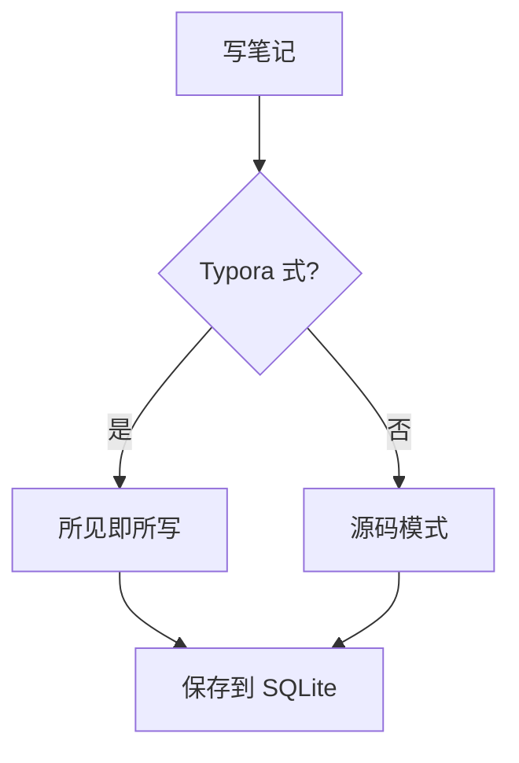
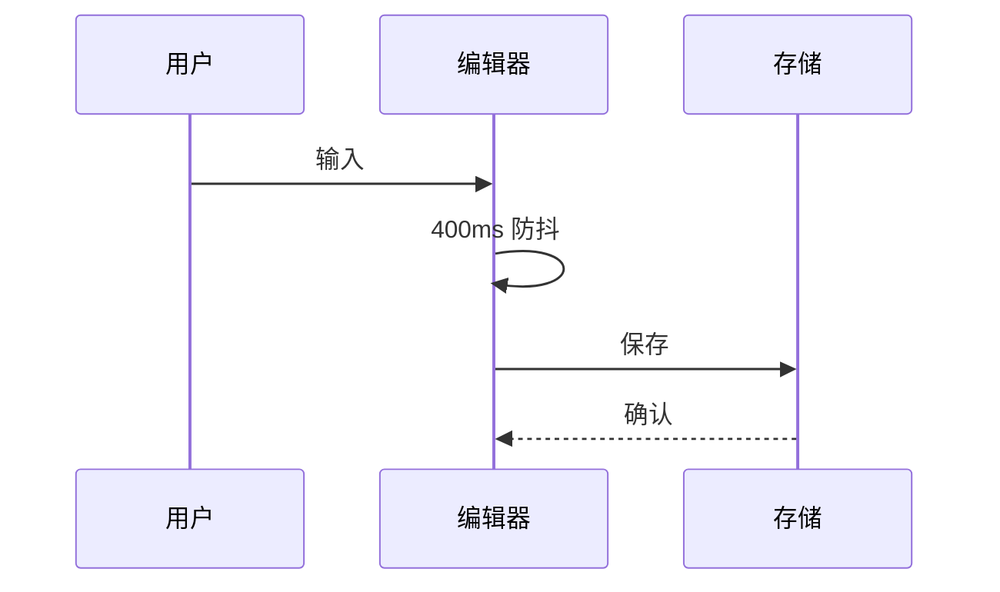
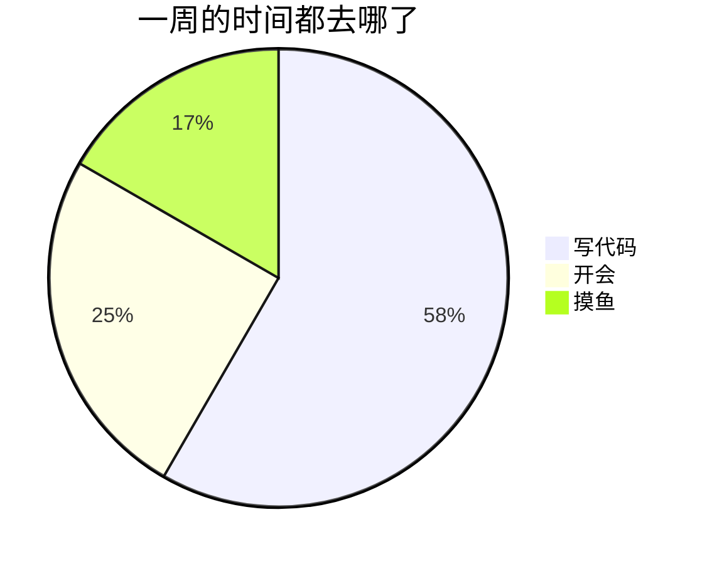

[TOC]

# 语法全览

这篇笔记把编辑器**现在支持的每一种语法**都用了一遍：前半段逐项示范，后半段是四十天的工作日志，用来看长文档下的输入延迟和滚动。光标进到哪一段，那一段就回到源码；光标离开，标记折叠、替身出现。

## 标题

上面的 `#` 是一级，这里是二级。下面从三级到六级各来一行：

### 三级标题

#### 四级标题

##### 五级标题

###### 六级标题

#### 结尾的井号可写可不写 ####

Setext 一级标题
===============

Setext 二级标题
---------------

## 行内样式

**粗体**、__也是粗体__、*斜体*、_也是斜体_、***粗斜体***、~~两个波浪线的删除线~~、~一个波浪线也是删除线~、<u>下划线</u>、<ins>插入</ins>、==荧光笔高亮==、`行内代码`、H<sub>2</sub>O 的下标、x^2^ 的上标、<sup>HTML 上标</sup>、<kbd>Ctrl</kbd> + <kbd>Shift</kbd> + <kbd>P</kbd>、<small>小字</small>、<big>大字</big>、<mark>HTML 高亮</mark>、<span style="color:#c8483d">红色文字</span>、<span style="background-color:#fff3b0;font-weight:600">带底色的粗字</span>、<font color="#2f63d8" size="4">老式 font 标签</font>、<cite>引文</cite>、<abbr title="Central Processing Unit">CPU</abbr>。

嵌套也行：**粗体里套 *斜体* 和 `代码`**，*斜体里套 ~~删除线~~*，==高亮里套 **粗体**==。

同样的样式也能用 HTML 标签写，和 Markdown 走同一套样式：<b>b</b>、<strong>strong</strong>、<i>i</i>、<em>em</em>、<var>var</var>、<s>s</s>、<del>del</del>、<strike>strike</strike>、<code>code</code>、<samp>samp</samp>。

`style` 只放行排版属性：<span style="font-size:1.25em">字号</span>、<span style="font-style:italic">斜体</span>、<span style="font-family:serif">衬线字体</span>、<span style="text-decoration:underline wavy">波浪下划线</span>、<span style="text-decoration:line-through dotted">点状删除线</span>、<span style="vertical-align:super;font-size:0.8em">抬高</span>；<span style="position:fixed;top:0;color:#c8483d">这里的 position 被丢掉，只留下颜色</span>。

转义：\*不是斜体\*、\# 不是标题、\[不是链接\]、反斜杠本身 \\。

实体：&copy; 2026 &mdash; &ldquo;引号&rdquo; &hellip; &nbsp;&nbsp;&nbsp;&nbsp;四个不换行空格 &lt;tag&gt; &amp; &#8594; &#x2665;

Emoji 短码：:smile: :rocket: :tada: :bug: :white_check_mark: :warning: :thinking: :coffee: :nope_not_a_code:

动态表情（Ctrl/⌘ + E 打开选择器，悬停会动），一共 36 个：

- 心情：:otw_smile: :otw_laugh: :otw_love: :otw_sad: :otw_think: :otw_wow:
- 干劲：:otw_done: :otw_fire: :otw_rocket: :otw_target: :otw_idea: :otw_coffee:
- 在路上：:otw_way: :otw_flag: :otw_pin: :otw_bell: :otw_hourglass: :otw_write:
- 日常：:otw_sun: :otw_rain: :otw_moon: :otw_sprout: :otw_star: :otw_party:
- 打工人：:otw_fish: :otw_flat: :otw_bald: :otw_offwork: :otw_charge: :otw_boba:
- 吃瓜：:otw_melon: :otw_pigeon: :otw_lemon: :otw_crack: :otw_666: :otw_soul:

挨着写也行：:otw_done::otw_fire::otw_party:。不在这套里的 :otw_nope: 和上面的 :nope_not_a_code: 一样，保持原样。

智能标点：这是半破折号 -- 这是全破折号 --- 省略号 ... 版权 (c) 注册 (r) 商标 (tm)。代码里的 `--flag` 和 `...rest` 不会被动。

硬换行：这一行结尾有两个空格
所以这里是第二行，反斜杠换行\
这是第三行。<br>而这是 HTML 的 `<br>` 换出来的第四行。

<!-- 这是一条行内注释，光标不在这一行时只显示一个小标记 -->

## 链接

- 行内链接：[Tauri 官网](https://tauri.app "桌面应用框架")
- 引用式链接：[CodeMirror][cm] 和 [lezer]
- 自动链接：<https://katex.org> 以及裸地址 https://mermaid.js.org 和 www.example.com
- HTML 锚：<a href="https://github.com/codemirror/dev">codemirror/dev</a>，也可以写 <a href="mailto:hello@example.com">发邮件</a> 和 <a href="tel:10086">打电话</a>；`javascript:` 这类地址不会被放行
- 邮件：<mailto:hello@example.com>
- 双链：[[语法全览与长文压力测试]]、带别名 [[语法全览与长文压力测试|本篇]]、跳到小节 [[语法全览与长文压力测试#数学公式|公式那一节]]、块引用 [[语法全览与长文压力测试^abc123]]（块 id 目前只识别，还不会定位）

按住 Ctrl/⌘ 点击：外链用系统浏览器打开，双链跳到标题完全一致的笔记，带 `#小节` 的再滚到那一节。双链按笔记标题匹配，把这篇笔记的标题起成「语法全览与长文压力测试」，上面几个双链就能跳回本篇。

[cm]: https://codemirror.net/
[lezer]: https://lezer.codemirror.net/ "增量解析器"

## 脚注

脚注在正文里是一个小徽章[^1]，悬停可以看到内容，点一下跳到定义；定义处点一下跳回来[^long]。同一个脚注可以引用多次[^1]。中文句子里两个脚注之间不带空格也不会被认成 `^上标^`。

[^1]: 第一条脚注，单个词。
[^long]: 这是一条 很长的 有很多空格的 脚注，以前这种会被当成引用而不是定义。

## 缩写

HTML 和 CSS 是前端的基础，HTML5 不是缩写定义里的词所以不会被标。CPU 在上面用 `<abbr>` 标过了。

*[HTML]: HyperText Markup Language
*[CSS]: Cascading Style Sheets

## 列表

- 无序列表第一项
- 第二项，带 **粗体** 和 `代码`
  - 二级 ◦
    - 三级 ▪
      - 四级又回到 •
- 第三项

1. 有序列表源码里全是 `1.`
1. 但显示的是 1 2 3
1. 自动编号
   1. 嵌套的有序列表
   1. 各自计数
   - 嵌套的无序
1. 第四项

起始编号取第一项的数字。和上一个列表之间得隔一段文字，只空一行的话会被接成同一个列表，编号跟着往下数：

5. 从五开始
5. 六
5. 七

3) 换成右括号就是新列表，只空一行也不会接上去
3) 所以这里从 3 开始

- [ ] 待办：写完这篇笔记
- [x] 已完成：把语法都塞进去
- [ ] 待办：看看长文档卡不卡
  - [x] 子任务也能勾
  - [ ] 嵌套的任务

## 定义列表

Typora 式编辑
: 文档始终是 Markdown 源文，装饰层只是隐藏标记、施加样式
: 光标进入哪个语法范围，哪个范围就回到源码

装饰
: CodeMirror 6 的 `Decoration`，分 mark / line / replace / widget 四种

术语和释义之间

: 隔一个空行也算，Markdown Extra 允许这么写

## 引用与 Callout

> 一层引用
> > 两层引用
> > > 三层引用
> > > > 四层引用

> [!NOTE]
> 这是 note，蓝色。

> [!TIP] 带自定义标题的小贴士
> 标题跟在徽章后面加粗显示。

> [!IMPORTANT]
> 紫色的重要提示，里面可以有 **粗体**、`代码` 和 [链接](https://example.com)。

> [!WARNING]- 默认收起的警告
> 这一段默认是折叠的，点徽章或者「展开」那一行就把源码里的 `-` 翻成 `+`。
> 第二行
> 第三行

> [!CAUTION]+ 默认展开但可以收起
> 点徽章可以收起。

> [!核心判断]
> 中文自定义标签走原型的样子：主色竖线、正文放大加重。

> [!注意]
> 中文别名也映射到语义色，「注意」= warning。

> [!INFO]
> 英文别名：INFO = NOTE，HINT = TIP，WARN = WARNING，DANGER / ERROR = CAUTION，大小写随意。

> [!提示]
> 全部中文别名：笔记 / 说明 / 备注 = note，提示 / 技巧 / 建议 = tip，重要 / 关键 = important，注意 / 警告 = warning，危险 / 错误 = caution。其余中文标签都走上面「核心判断」的中性样式。

> 普通引用里也能再套一个 callout：
>
> > [!TIP] 嵌在引用里的小贴士
> > `>` 前缀有几层都认。

## 代码

行内 `const x = 1` 和 ``含有 `反引号` 的代码``。

光标不在代码块里时，上下两行围栏折叠起来，语言名变成角上的小标签，旁边有「复制」按钮。

```ts
import { EditorView } from "@codemirror/view";

export function mount(parent: HTMLElement, doc: string): EditorView {
  // 光标不在的语法范围隐藏标记
  return new EditorView({ parent, doc });
}
```

```python
def fib(n: int) -> int:
    """朴素递归，只是为了看高亮。"""
    return n if n < 2 else fib(n - 1) + fib(n - 2)

print([fib(i) for i in range(10)])
```

```rust
fn main() {
    let notes: Vec<&str> = vec!["笔记", "待办", "目标"];
    for (i, n) in notes.iter().enumerate() {
        println!("{i}: {n}");
    }
}
```

```json
{ "name": "ontheway", "version": "0.1.0", "private": true }
```

```bash
pnpm dev --port 1420 && echo "started"
```

~~~
波浪线围栏，没有语言名
~~~

    四个空格缩进的代码块
    第二行

```csv
名字,数量,备注
苹果,3,"红的, 甜的"
梨,5,
香蕉,12,"带 ""引号"" 的字段"
```

```tsv
项目	进度	负责人
编辑器	90%	A
日历	60%	B
```

## 图表







写错了不会白屏，错误就地显示，点一下回到源码改：

```mermaid
graph TD
  A[少了箭头另一头] -->
```

## 表格

| 语法 | 状态 | 备注 |
|:-----|:----:|-----:|
| **粗体** | ✅ | 左对齐 |
| `代码` | ✅ | 居中 |
| ~删除~ | ✅ | 右对齐 |
| 多行<br>单元格 | ✅ | `<br>` 换行 |
| <kbd>Ctrl</kbd> + <kbd>K</kbd> | ✅ | 行内 HTML |
| [[双链]] 和 [链接](https://example.com) | ✅ | 链接 |
| :rocket: &amp; ==高亮== | ✅ | Emoji、实体、高亮 |
| :otw_star: 动态表情 | ✅ | 悬停会动 |
| 竖线要转义：a \| b | ✅ | `\|` |
| 代码里的竖线 `a | b` | ✅ | 不用转义 |

单元格里能用上面这些行内语法；公式和 `^上标^` 在单元格里暂时不渲染。

<table>
  <caption>HTML 表格的标题</caption>
  <thead>
    <tr><th>HTML 表头</th><th align="right">数值</th></tr>
  </thead>
  <tbody>
    <tr><td style="color:green">合并</td><td rowspan="2">2</td></tr>
    <tr><td>第二行</td></tr>
  </tbody>
  <tfoot>
    <tr><td colspan="2" align="center">colspan 横跨两列</td></tr>
  </tfoot>
</table>

## 图片


![引用式图片][pic]


本机图片写绝对路径，比如 `` 或 ``，桌面端会转成 asset 协议去读。相对路径没有基准目录，读不到。

[pic]: https://picsum.photos/seed/ref/400/200 "引用定义的图片"

## 分隔线

---

***

___

## 块级 HTML

<h3 onclick="alert('不会执行')">HTML 标题（事件属性会被丢掉）</h3>

<details open>
<summary>点开看看</summary>
藏在里面的内容，<b>粗体</b> 和 <i>斜体</i> 都能用。
</details>

<div align="center" style="color:#74746e">居中的一段灰字</div>

<blockquote>HTML 写的引用块</blockquote>

<ul>
  <li>HTML 列表 1</li>
  <li>HTML 列表 2</li>
</ul>

<ol start="3">
  <li>HTML 有序列表，从 3 开始</li>
  <li>四</li>
</ol>

<dl>
  <dt>HTML 定义列表</dt>
  <dd>dl / dt / dd 也在白名单里</dd>
</dl>

<figure>
  
  <figcaption>figure 和 figcaption：带图注的图片</figcaption>
</figure>

<pre>pre 里的   多个空格
    和缩进都原样保留</pre>

<script>alert("这一行会被整个丢掉")</script>

<iframe src="https://example.com"></iframe>

<p>上面的 script 和 iframe 都被整个丢掉了，style、表单、音视频也一样。</p>

<!--
整块注释
也会收成一个小标记
-->

## 数学公式

行内：质能方程 $E = mc^2$，欧拉公式 $e^{i\pi} + 1 = 0$，带星号的 $a*b$ 和 $c*d$ 不会被当成斜体，价格 $5 和 $10 也不会被当成公式。

块级：

$$
\sum_{i=1}^{n} x_i = \int_0^1 f(x)\,dx
$$

$$
\begin{aligned}
\nabla \cdot \mathbf{E} &= \frac{\rho}{\varepsilon_0} \\
\nabla \cdot \mathbf{B} &= 0 \\
\nabla \times \mathbf{E} &= -\frac{\partial \mathbf{B}}{\partial t}
\end{aligned}
$$

`$$…$$` 独占一行时，写在同一行里也是块级公式：

$$ \frac{a}{b} = \sqrt{c} $$

夹在段落中间的 $$ \frac{a}{b} = \sqrt{c} $$ 只按行内公式排。

## 目录与点击

开头那行 `[TOC]` 换成了可点击的目录，写成 `[[TOC]]` 也认。其他能点的地方：任务的勾选框、callout 徽章（收起 / 展开）、脚注徽章（在引用和定义之间来回跳）、目录条目（滚到那一节）。表格、图表、公式、HTML 块点一下回到源码。

## 快捷键

| 操作 | Windows | macOS |
|:-----|:--------|:------|
| 一到六级标题 / 变回正文 | <kbd>Ctrl</kbd> + <kbd>1</kbd>…<kbd>6</kbd> / <kbd>0</kbd> | <kbd>⌘</kbd> + <kbd>1</kbd>…<kbd>6</kbd> / <kbd>0</kbd> |
| 井号加一 / 减一 | <kbd>Ctrl</kbd> + <kbd>=</kbd> / <kbd>-</kbd> | <kbd>⌘</kbd> + <kbd>=</kbd> / <kbd>-</kbd> |
| 粗体 / 斜体 / 下划线 | <kbd>Ctrl</kbd> + <kbd>B</kbd> / <kbd>I</kbd> / <kbd>U</kbd> | <kbd>⌘</kbd> + <kbd>B</kbd> / <kbd>I</kbd> / <kbd>U</kbd> |
| 行内代码 | <kbd>Ctrl</kbd> + <kbd>Shift</kbd> + <kbd>&#96;</kbd> | <kbd>⌘</kbd> + <kbd>Shift</kbd> + <kbd>&#96;</kbd> |
| 删除线 | <kbd>Alt</kbd> + <kbd>Shift</kbd> + <kbd>5</kbd> | <kbd>Ctrl</kbd> + <kbd>Shift</kbd> + <kbd>&#96;</kbd> |
| 插入链接 / 图片 | <kbd>Ctrl</kbd> + <kbd>Shift</kbd> + <kbd>K</kbd> / <kbd>I</kbd> | <kbd>⌘</kbd> + <kbd>Shift</kbd> + <kbd>K</kbd> / <kbd>Ctrl</kbd> + <kbd>⌘</kbd> + <kbd>I</kbd> |
| 代码块 | <kbd>Ctrl</kbd> + <kbd>Alt</kbd> + <kbd>C</kbd> | <kbd>⌘</kbd> + <kbd>⌥</kbd> + <kbd>C</kbd> |
| 表格 | <kbd>Ctrl</kbd> + <kbd>T</kbd> | <kbd>⌘</kbd> + <kbd>⌥</kbd> + <kbd>T</kbd> |
| 引用 | <kbd>Ctrl</kbd> + <kbd>Shift</kbd> + <kbd>Q</kbd> | <kbd>⌘</kbd> + <kbd>⌥</kbd> + <kbd>Q</kbd> |
| 有序 / 无序列表 | <kbd>Ctrl</kbd> + <kbd>Shift</kbd> + <kbd>[</kbd> / <kbd>]</kbd> | <kbd>⌘</kbd> + <kbd>⌥</kbd> + <kbd>O</kbd> / <kbd>U</kbd> |
| 缩进 / 反缩进 | <kbd>Ctrl</kbd> + <kbd>]</kbd> / <kbd>[</kbd>，或 <kbd>Tab</kbd> / <kbd>Shift</kbd> + <kbd>Tab</kbd> | <kbd>⌘</kbd> + <kbd>]</kbd> / <kbd>[</kbd>，或 <kbd>Tab</kbd> / <kbd>Shift</kbd> + <kbd>Tab</kbd> |
| 清除格式 | <kbd>Ctrl</kbd> + <kbd>&#92;</kbd> | <kbd>⌘</kbd> + <kbd>&#92;</kbd> |
| 选中整行 | <kbd>Ctrl</kbd> + <kbd>L</kbd> | <kbd>⌘</kbd> + <kbd>L</kbd> |
| 查找 / 替换 | <kbd>Ctrl</kbd> + <kbd>F</kbd> | <kbd>⌘</kbd> + <kbd>F</kbd> |
| 动态表情 | <kbd>Ctrl</kbd> + <kbd>E</kbd> | <kbd>⌘</kbd> + <kbd>E</kbd> |
| 立即保存 | <kbd>Ctrl</kbd> + <kbd>S</kbd> | <kbd>⌘</kbd> + <kbd>S</kbd> |
| 打开链接 / 双链 | <kbd>Ctrl</kbd> + 点击 | <kbd>⌘</kbd> + 点击 |
| 命令面板 | <kbd>Ctrl</kbd> + <kbd>K</kbd> | <kbd>⌘</kbd> + <kbd>K</kbd> |

---

# 长文压力测试：四十天工作日志

下面四十天的日志是为了把文档撑长，每一天都混用标题、列表、任务、callout、表格、代码、公式和脚注。看的是：打字有没有延迟、滚动顺不顺、光标进出块时替身切换快不快。
## 第 1 天 · 2026-08-01 · 编辑器装饰层

今天主要在做 **编辑器装饰层**。把块级和行内两层拆开之后，长文档每次按键的开销从 5ms 降到 0.6ms。 和 阿伟 对了一遍方案，==结论是先把最小可用的版本合进去==，剩下的~边角~ ~~以后再说~~，详见脚注[^d1]。上午 -- 下午各推进了一轮 ... 大致是这样。

- [x] 写方案
- [ ] 跑通测试
- [ ] 走查暗色模式
  - [ ] 五个视图各种选中态
  - [x] 笔记页已过

> [!TIP]
> 把块级和行内两层拆开之后，长文档每次按键的开销从 5ms 降到 0.6ms。
> 第 1 天的第二行，带 `代码` 和 *斜体*。

| 指标 | 上周 | 本周 | 变化 |
|---|---:|---:|:---:|
| 按键延迟 (ms) | 5.25 | 0.58 | ⬇ |
| 首屏 (ms) | 1157 | 818 | ⬇ |
| 测试数 | 102 | 113 | ⬆ |

1. 先做 编辑器装饰层 的最小版本
1. 再补测试
1. 最后更新技术方案
   1. 表格
   1. 坑记录

[^d1]: 第 1 天的脚注：把块级和行内两层拆开之后，长文档每次按键的开销从 5ms 降到 0.6ms。

## 第 2 天 · 2026-08-02 · 列表栏动画

今天主要在做 **列表栏动画**。marginLeft 是布局属性，每一帧都在重排，改成 transform 之后掉帧没了。 和 Mia 对了一遍方案，==结论是先把最小可用的版本合进去==，剩下的~边角~ ~~以后再说~~，详见脚注[^d2]。上午 -- 下午各推进了一轮 ... 大致是这样。

- [x] 写方案
- [x] 跑通测试
- [ ] 走查暗色模式
  - [ ] 五个视图各种选中态
  - [x] 笔记页已过

> [!IMPORTANT]
> marginLeft 是布局属性，每一帧都在重排，改成 transform 之后掉帧没了。
> 第 2 天的第二行，带 `代码` 和 *斜体*。

| 指标 | 上周 | 本周 | 变化 |
|---|---:|---:|:---:|
| 按键延迟 (ms) | 5.20 | 0.59 | ⬇ |
| 首屏 (ms) | 1154 | 816 | ⬇ |
| 测试数 | 104 | 116 | ⬆ |

1. 先做 列表栏动画 的最小版本
1. 再补测试
1. 最后更新技术方案
   1. 表格
   1. 坑记录

```python
def median(xs):
    xs = sorted(xs)
    n = len(xs)
    return xs[n // 2] if n % 2 else (xs[n // 2 - 1] + xs[n // 2]) / 2
```

[^d2]: 第 2 天的脚注：marginLeft 是布局属性，每一帧都在重排，改成 transform 之后掉帧没了。

## 第 3 天 · 2026-08-03 · 字重过渡

今天主要在做 **字重过渡**。中文每个小数字重都要重新匹配回退字体，一帧十几毫秒，直接不过渡。 和 老张 对了一遍方案，==结论是先把最小可用的版本合进去==，剩下的~边角~ ~~以后再说~~，详见脚注[^d3]。上午 -- 下午各推进了一轮 ... 大致是这样。

- [x] 写方案
- [x] 跑通测试
- [x] 走查暗色模式
  - [ ] 五个视图各种选中态
  - [x] 笔记页已过

> [!WARNING] 第 3 天的结论
> 中文每个小数字重都要重新匹配回退字体，一帧十几毫秒，直接不过渡。
> 第 3 天的第二行，带 `代码` 和 *斜体*。

| 指标 | 上周 | 本周 | 变化 |
|---|---:|---:|:---:|
| 按键延迟 (ms) | 5.15 | 0.60 | ⬇ |
| 首屏 (ms) | 1151 | 814 | ⬇ |
| 测试数 | 106 | 119 | ⬆ |

1. 先做 字重过渡 的最小版本
1. 再补测试
1. 最后更新技术方案
   1. 表格
   1. 坑记录

复杂度大概是 $O(n \log n)$，其中 $n = 300$；空间 $O(n)$。

[^d3]: 第 3 天的脚注：中文每个小数字重都要重新匹配回退字体，一帧十几毫秒，直接不过渡。

## 第 4 天 · 2026-08-04 · HTML 净化

今天主要在做 **HTML 净化**。DOMParser 解析到惰性文档，再按白名单逐节点重建，用户字符串永远不进 innerHTML。 和 Yuki 对了一遍方案，==结论是先把最小可用的版本合进去==，剩下的~边角~ ~~以后再说~~，详见脚注[^d4]。上午 -- 下午各推进了一轮 ... 大致是这样。

- [ ] 写方案
- [ ] 跑通测试
- [ ] 走查暗色模式
  - [ ] 五个视图各种选中态
  - [x] 笔记页已过

> [!CAUTION]
> DOMParser 解析到惰性文档，再按白名单逐节点重建，用户字符串永远不进 innerHTML。
> 第 4 天的第二行，带 `代码` 和 *斜体*。

| 指标 | 上周 | 本周 | 变化 |
|---|---:|---:|:---:|
| 按键延迟 (ms) | 5.10 | 0.61 | ⬇ |
| 首屏 (ms) | 1148 | 812 | ⬇ |
| 测试数 | 108 | 122 | ⬆ |

1. 先做 HTML 净化 的最小版本
1. 再补测试
1. 最后更新技术方案
   1. 表格
   1. 坑记录

```ts
export const debounce = (fn: () => void, ms: number) => {{
  let t: ReturnType<typeof setTimeout> | null = null;
  return () => {{
    if (t) clearTimeout(t);
    t = setTimeout(fn, ms);
  }};
}};
```

[^d4]: 第 4 天的脚注：DOMParser 解析到惰性文档，再按白名单逐节点重建，用户字符串永远不进 innerHTML。

## 第 5 天 · 2026-08-05 · 公式渲染

今天主要在做 **公式渲染**。KaTeX 首次出现公式才拉分包，拉到前显示等宽 TeX 源。 和 小林 对了一遍方案，==结论是先把最小可用的版本合进去==，剩下的~边角~ ~~以后再说~~，详见脚注[^d5]。上午 -- 下午各推进了一轮 ... 大致是这样。

- [x] 写方案
- [ ] 跑通测试
- [ ] 走查暗色模式
  - [ ] 五个视图各种选中态
  - [x] 笔记页已过

> [!核心判断]+
> KaTeX 首次出现公式才拉分包，拉到前显示等宽 TeX 源。
> 第 5 天的第二行，带 `代码` 和 *斜体*。

| 指标 | 上周 | 本周 | 变化 |
|---|---:|---:|:---:|
| 按键延迟 (ms) | 5.05 | 0.62 | ⬇ |
| 首屏 (ms) | 1145 | 810 | ⬇ |
| 测试数 | 110 | 125 | ⬆ |

1. 先做 公式渲染 的最小版本
1. 再补测试
1. 最后更新技术方案
   1. 表格
   1. 坑记录

[^d5]: 第 5 天的脚注：KaTeX 首次出现公式才拉分包，拉到前显示等宽 TeX 源。

## 第 6 天 · 2026-08-06 · 图表渲染

今天主要在做 **图表渲染**。mermaid 的 SVG 经 DOMParser 只收 svg 节点，语法错误在原位显示。 和 阿伟 对了一遍方案，==结论是先把最小可用的版本合进去==，剩下的~边角~ ~~以后再说~~，详见脚注[^d6]。上午 -- 下午各推进了一轮 ... 大致是这样。

- [x] 写方案
- [x] 跑通测试
- [ ] 走查暗色模式
  - [ ] 五个视图各种选中态
  - [x] 笔记页已过

> [!当时的结论] 第 6 天的结论
> mermaid 的 SVG 经 DOMParser 只收 svg 节点，语法错误在原位显示。
> 第 6 天的第二行，带 `代码` 和 *斜体*。

| 指标 | 上周 | 本周 | 变化 |
|---|---:|---:|:---:|
| 按键延迟 (ms) | 5.00 | 0.63 | ⬇ |
| 首屏 (ms) | 1142 | 808 | ⬇ |
| 测试数 | 112 | 128 | ⬆ |

1. 先做 图表渲染 的最小版本
1. 再补测试
1. 最后更新技术方案
   1. 表格
   1. 坑记录

```python
def median(xs):
    xs = sorted(xs)
    n = len(xs)
    return xs[n // 2] if n % 2 else (xs[n // 2 - 1] + xs[n // 2]) / 2
```

复杂度大概是 $O(n \log n)$，其中 $n = 600$；空间 $O(n)$。

$$
T(n) = 6 \cdot n \log_2 n + \sum_{k=1}^{6} \frac{1}{k}
$$

[^d6]: 第 6 天的脚注：mermaid 的 SVG 经 DOMParser 只收 svg 节点，语法错误在原位显示。

## 第 7 天 · 2026-08-07 · 脚注跳转

今天主要在做 **脚注跳转**。引用徽章点一下跳到定义，定义徽章点一下跳回第一处引用。 和 Mia 对了一遍方案，==结论是先把最小可用的版本合进去==，剩下的~边角~ ~~以后再说~~，详见脚注[^d7]。上午 -- 下午各推进了一轮 ... 大致是这样。

- [x] 写方案
- [x] 跑通测试
- [x] 走查暗色模式
  - [ ] 五个视图各种选中态
  - [x] 笔记页已过

> [!提示]-
> 引用徽章点一下跳到定义，定义徽章点一下跳回第一处引用。
> 第 7 天的第二行，带 `代码` 和 *斜体*。

| 指标 | 上周 | 本周 | 变化 |
|---|---:|---:|:---:|
| 按键延迟 (ms) | 4.95 | 0.64 | ⬇ |
| 首屏 (ms) | 1139 | 806 | ⬇ |
| 测试数 | 114 | 131 | ⬆ |

1. 先做 脚注跳转 的最小版本
1. 再补测试
1. 最后更新技术方案
   1. 表格
   1. 坑记录

[^d7]: 第 7 天的脚注：引用徽章点一下跳到定义，定义徽章点一下跳回第一处引用。

## 第 8 天 · 2026-08-08 · 双链小节

今天主要在做 **双链小节**。跳到目标笔记之后再滚到小节，靠 pendingAnchor 在目录算出来后消费。 和 老张 对了一遍方案，==结论是先把最小可用的版本合进去==，剩下的~边角~ ~~以后再说~~，详见脚注[^d8]。上午 -- 下午各推进了一轮 ... 大致是这样。

- [ ] 写方案
- [ ] 跑通测试
- [ ] 走查暗色模式
  - [ ] 五个视图各种选中态
  - [x] 笔记页已过

> [!注意]
> 跳到目标笔记之后再滚到小节，靠 pendingAnchor 在目录算出来后消费。
> 第 8 天的第二行，带 `代码` 和 *斜体*。

| 指标 | 上周 | 本周 | 变化 |
|---|---:|---:|:---:|
| 按键延迟 (ms) | 4.90 | 0.65 | ⬇ |
| 首屏 (ms) | 1136 | 804 | ⬇ |
| 测试数 | 116 | 134 | ⬆ |

1. 先做 双链小节 的最小版本
1. 再补测试
1. 最后更新技术方案
   1. 表格
   1. 坑记录

```ts
export const debounce = (fn: () => void, ms: number) => {{
  let t: ReturnType<typeof setTimeout> | null = null;
  return () => {{
    if (t) clearTimeout(t);
    t = setTimeout(fn, ms);
  }};
}};
```


[^d8]: 第 8 天的脚注：跳到目标笔记之后再滚到小节，靠 pendingAnchor 在目录算出来后消费。

## 第 9 天 · 2026-08-09 · 数据同步

今天主要在做 **数据同步**。外部回填只在本地没有未同步编辑时才做，用户已经动过的内容永远优先。 和 Yuki 对了一遍方案，==结论是先把最小可用的版本合进去==，剩下的~边角~ ~~以后再说~~，详见脚注[^d9]。上午 -- 下午各推进了一轮 ... 大致是这样。

- [x] 写方案
- [ ] 跑通测试
- [ ] 走查暗色模式
  - [ ] 五个视图各种选中态
  - [x] 笔记页已过

> [!NOTE] 第 9 天的结论
> 外部回填只在本地没有未同步编辑时才做，用户已经动过的内容永远优先。
> 第 9 天的第二行，带 `代码` 和 *斜体*。

| 指标 | 上周 | 本周 | 变化 |
|---|---:|---:|:---:|
| 按键延迟 (ms) | 4.85 | 0.66 | ⬇ |
| 首屏 (ms) | 1133 | 802 | ⬇ |
| 测试数 | 118 | 137 | ⬆ |

1. 先做 数据同步 的最小版本
1. 再补测试
1. 最后更新技术方案
   1. 表格
   1. 坑记录

复杂度大概是 $O(n \log n)$，其中 $n = 900$；空间 $O(n)$。

[^d9]: 第 9 天的脚注：外部回填只在本地没有未同步编辑时才做，用户已经动过的内容永远优先。

## 第 10 天 · 2026-08-10 · 零点翻页

今天主要在做 **零点翻页**。setTimeout 对准下一个零点，醒来时再对一次表。 和 小林 对了一遍方案，==结论是先把最小可用的版本合进去==，剩下的~边角~ ~~以后再说~~，详见脚注[^d10]。上午 -- 下午各推进了一轮 ... 大致是这样。

- [x] 写方案
- [x] 跑通测试
- [ ] 走查暗色模式
  - [ ] 五个视图各种选中态
  - [x] 笔记页已过

> [!TIP]+
> setTimeout 对准下一个零点，醒来时再对一次表。
> 第 10 天的第二行，带 `代码` 和 *斜体*。

| 指标 | 上周 | 本周 | 变化 |
|---|---:|---:|:---:|
| 按键延迟 (ms) | 4.80 | 0.67 | ⬇ |
| 首屏 (ms) | 1130 | 800 | ⬇ |
| 测试数 | 120 | 140 | ⬆ |

1. 先做 零点翻页 的最小版本
1. 再补测试
1. 最后更新技术方案
   1. 表格
   1. 坑记录

```python
def median(xs):
    xs = sorted(xs)
    n = len(xs)
    return xs[n // 2] if n % 2 else (xs[n // 2 - 1] + xs[n // 2]) / 2
```

<details>
<summary>第 10 天的原始记录</summary>
<p>这一段是 <b>HTML</b> 写的折叠面板，光标不在时是真正的 details 元素。</p>
</details>

[^d10]: 第 10 天的脚注：setTimeout 对准下一个零点，醒来时再对一次表。

## 第 11 天 · 2026-08-11 · 编辑器装饰层

今天主要在做 **编辑器装饰层**。把块级和行内两层拆开之后，长文档每次按键的开销从 5ms 降到 0.6ms。 和 阿伟 对了一遍方案，==结论是先把最小可用的版本合进去==，剩下的~边角~ ~~以后再说~~，详见脚注[^d11]。上午 -- 下午各推进了一轮 ... 大致是这样。

- [x] 写方案
- [x] 跑通测试
- [x] 走查暗色模式
  - [ ] 五个视图各种选中态
  - [x] 笔记页已过

> [!IMPORTANT]
> 把块级和行内两层拆开之后，长文档每次按键的开销从 5ms 降到 0.6ms。
> 第 11 天的第二行，带 `代码` 和 *斜体*。

| 指标 | 上周 | 本周 | 变化 |
|---|---:|---:|:---:|
| 按键延迟 (ms) | 4.75 | 0.68 | ⬇ |
| 首屏 (ms) | 1127 | 798 | ⬇ |
| 测试数 | 122 | 143 | ⬆ |

1. 先做 编辑器装饰层 的最小版本
1. 再补测试
1. 最后更新技术方案
   1. 表格
   1. 坑记录

[^d11]: 第 11 天的脚注：把块级和行内两层拆开之后，长文档每次按键的开销从 5ms 降到 0.6ms。

## 第 12 天 · 2026-08-12 · 列表栏动画

今天主要在做 **列表栏动画**。marginLeft 是布局属性，每一帧都在重排，改成 transform 之后掉帧没了。 和 Mia 对了一遍方案，==结论是先把最小可用的版本合进去==，剩下的~边角~ ~~以后再说~~，详见脚注[^d12]。上午 -- 下午各推进了一轮 ... 大致是这样。

- [ ] 写方案
- [ ] 跑通测试
- [ ] 走查暗色模式
  - [ ] 五个视图各种选中态
  - [x] 笔记页已过

> [!WARNING] 第 12 天的结论
> marginLeft 是布局属性，每一帧都在重排，改成 transform 之后掉帧没了。
> 第 12 天的第二行，带 `代码` 和 *斜体*。

| 指标 | 上周 | 本周 | 变化 |
|---|---:|---:|:---:|
| 按键延迟 (ms) | 4.70 | 0.69 | ⬇ |
| 首屏 (ms) | 1124 | 796 | ⬇ |
| 测试数 | 124 | 146 | ⬆ |

1. 先做 列表栏动画 的最小版本
1. 再补测试
1. 最后更新技术方案
   1. 表格
   1. 坑记录

```ts
export const debounce = (fn: () => void, ms: number) => {{
  let t: ReturnType<typeof setTimeout> | null = null;
  return () => {{
    if (t) clearTimeout(t);
    t = setTimeout(fn, ms);
  }};
}};
```

复杂度大概是 $O(n \log n)$，其中 $n = 1200$；空间 $O(n)$。

$$
T(n) = 12 \cdot n \log_2 n + \sum_{k=1}^{12} \frac{1}{k}
$$

[^d12]: 第 12 天的脚注：marginLeft 是布局属性，每一帧都在重排，改成 transform 之后掉帧没了。

## 第 13 天 · 2026-08-13 · 字重过渡

今天主要在做 **字重过渡**。中文每个小数字重都要重新匹配回退字体，一帧十几毫秒，直接不过渡。 和 老张 对了一遍方案，==结论是先把最小可用的版本合进去==，剩下的~边角~ ~~以后再说~~，详见脚注[^d13]。上午 -- 下午各推进了一轮 ... 大致是这样。

- [x] 写方案
- [ ] 跑通测试
- [ ] 走查暗色模式
  - [ ] 五个视图各种选中态
  - [x] 笔记页已过

> [!CAUTION]
> 中文每个小数字重都要重新匹配回退字体，一帧十几毫秒，直接不过渡。
> 第 13 天的第二行，带 `代码` 和 *斜体*。

| 指标 | 上周 | 本周 | 变化 |
|---|---:|---:|:---:|
| 按键延迟 (ms) | 4.65 | 0.70 | ⬇ |
| 首屏 (ms) | 1121 | 794 | ⬇ |
| 测试数 | 126 | 149 | ⬆ |

1. 先做 字重过渡 的最小版本
1. 再补测试
1. 最后更新技术方案
   1. 表格
   1. 坑记录

[^d13]: 第 13 天的脚注：中文每个小数字重都要重新匹配回退字体，一帧十几毫秒，直接不过渡。

## 第 14 天 · 2026-08-14 · HTML 净化

今天主要在做 **HTML 净化**。DOMParser 解析到惰性文档，再按白名单逐节点重建，用户字符串永远不进 innerHTML。 和 Yuki 对了一遍方案，==结论是先把最小可用的版本合进去==，剩下的~边角~ ~~以后再说~~，详见脚注[^d14]。上午 -- 下午各推进了一轮 ... 大致是这样。

- [x] 写方案
- [x] 跑通测试
- [ ] 走查暗色模式
  - [ ] 五个视图各种选中态
  - [x] 笔记页已过

> [!核心判断]-
> DOMParser 解析到惰性文档，再按白名单逐节点重建，用户字符串永远不进 innerHTML。
> 第 14 天的第二行，带 `代码` 和 *斜体*。

| 指标 | 上周 | 本周 | 变化 |
|---|---:|---:|:---:|
| 按键延迟 (ms) | 4.60 | 0.71 | ⬇ |
| 首屏 (ms) | 1118 | 792 | ⬇ |
| 测试数 | 128 | 152 | ⬆ |

1. 先做 HTML 净化 的最小版本
1. 再补测试
1. 最后更新技术方案
   1. 表格
   1. 坑记录

```python
def median(xs):
    xs = sorted(xs)
    n = len(xs)
    return xs[n // 2] if n % 2 else (xs[n // 2 - 1] + xs[n // 2]) / 2
```

[^d14]: 第 14 天的脚注：DOMParser 解析到惰性文档，再按白名单逐节点重建，用户字符串永远不进 innerHTML。

## 第 15 天 · 2026-08-15 · 公式渲染

今天主要在做 **公式渲染**。KaTeX 首次出现公式才拉分包，拉到前显示等宽 TeX 源。 和 小林 对了一遍方案，==结论是先把最小可用的版本合进去==，剩下的~边角~ ~~以后再说~~，详见脚注[^d15]。上午 -- 下午各推进了一轮 ... 大致是这样。

- [x] 写方案
- [x] 跑通测试
- [x] 走查暗色模式
  - [ ] 五个视图各种选中态
  - [x] 笔记页已过

> [!当时的结论]+ 第 15 天的结论
> KaTeX 首次出现公式才拉分包，拉到前显示等宽 TeX 源。
> 第 15 天的第二行，带 `代码` 和 *斜体*。

| 指标 | 上周 | 本周 | 变化 |
|---|---:|---:|:---:|
| 按键延迟 (ms) | 4.55 | 0.72 | ⬇ |
| 首屏 (ms) | 1115 | 790 | ⬇ |
| 测试数 | 130 | 155 | ⬆ |

1. 先做 公式渲染 的最小版本
1. 再补测试
1. 最后更新技术方案
   1. 表格
   1. 坑记录

复杂度大概是 $O(n \log n)$，其中 $n = 1500$；空间 $O(n)$。

[^d15]: 第 15 天的脚注：KaTeX 首次出现公式才拉分包，拉到前显示等宽 TeX 源。

## 第 16 天 · 2026-08-16 · 图表渲染

今天主要在做 **图表渲染**。mermaid 的 SVG 经 DOMParser 只收 svg 节点，语法错误在原位显示。 和 阿伟 对了一遍方案，==结论是先把最小可用的版本合进去==，剩下的~边角~ ~~以后再说~~，详见脚注[^d16]。上午 -- 下午各推进了一轮 ... 大致是这样。

- [ ] 写方案
- [ ] 跑通测试
- [ ] 走查暗色模式
  - [ ] 五个视图各种选中态
  - [x] 笔记页已过

> [!提示]
> mermaid 的 SVG 经 DOMParser 只收 svg 节点，语法错误在原位显示。
> 第 16 天的第二行，带 `代码` 和 *斜体*。

| 指标 | 上周 | 本周 | 变化 |
|---|---:|---:|:---:|
| 按键延迟 (ms) | 4.50 | 0.73 | ⬇ |
| 首屏 (ms) | 1112 | 788 | ⬇ |
| 测试数 | 132 | 158 | ⬆ |

1. 先做 图表渲染 的最小版本
1. 再补测试
1. 最后更新技术方案
   1. 表格
   1. 坑记录

```ts
export const debounce = (fn: () => void, ms: number) => {{
  let t: ReturnType<typeof setTimeout> | null = null;
  return () => {{
    if (t) clearTimeout(t);
    t = setTimeout(fn, ms);
  }};
}};
```


[^d16]: 第 16 天的脚注：mermaid 的 SVG 经 DOMParser 只收 svg 节点，语法错误在原位显示。

## 第 17 天 · 2026-08-17 · 脚注跳转

今天主要在做 **脚注跳转**。引用徽章点一下跳到定义，定义徽章点一下跳回第一处引用。 和 Mia 对了一遍方案，==结论是先把最小可用的版本合进去==，剩下的~边角~ ~~以后再说~~，详见脚注[^d17]。上午 -- 下午各推进了一轮 ... 大致是这样。

- [x] 写方案
- [ ] 跑通测试
- [ ] 走查暗色模式
  - [ ] 五个视图各种选中态
  - [x] 笔记页已过

> [!注意]
> 引用徽章点一下跳到定义，定义徽章点一下跳回第一处引用。
> 第 17 天的第二行，带 `代码` 和 *斜体*。

| 指标 | 上周 | 本周 | 变化 |
|---|---:|---:|:---:|
| 按键延迟 (ms) | 4.45 | 0.74 | ⬇ |
| 首屏 (ms) | 1109 | 786 | ⬇ |
| 测试数 | 134 | 161 | ⬆ |

1. 先做 脚注跳转 的最小版本
1. 再补测试
1. 最后更新技术方案
   1. 表格
   1. 坑记录

[^d17]: 第 17 天的脚注：引用徽章点一下跳到定义，定义徽章点一下跳回第一处引用。

## 第 18 天 · 2026-08-18 · 双链小节

今天主要在做 **双链小节**。跳到目标笔记之后再滚到小节，靠 pendingAnchor 在目录算出来后消费。 和 老张 对了一遍方案，==结论是先把最小可用的版本合进去==，剩下的~边角~ ~~以后再说~~，详见脚注[^d18]。上午 -- 下午各推进了一轮 ... 大致是这样。

- [x] 写方案
- [x] 跑通测试
- [ ] 走查暗色模式
  - [ ] 五个视图各种选中态
  - [x] 笔记页已过

> [!NOTE] 第 18 天的结论
> 跳到目标笔记之后再滚到小节，靠 pendingAnchor 在目录算出来后消费。
> 第 18 天的第二行，带 `代码` 和 *斜体*。

| 指标 | 上周 | 本周 | 变化 |
|---|---:|---:|:---:|
| 按键延迟 (ms) | 4.40 | 0.75 | ⬇ |
| 首屏 (ms) | 1106 | 784 | ⬇ |
| 测试数 | 136 | 164 | ⬆ |

1. 先做 双链小节 的最小版本
1. 再补测试
1. 最后更新技术方案
   1. 表格
   1. 坑记录

```python
def median(xs):
    xs = sorted(xs)
    n = len(xs)
    return xs[n // 2] if n % 2 else (xs[n // 2 - 1] + xs[n // 2]) / 2
```

复杂度大概是 $O(n \log n)$，其中 $n = 1800$；空间 $O(n)$。

$$
T(n) = 18 \cdot n \log_2 n + \sum_{k=1}^{18} \frac{1}{k}
$$

[^d18]: 第 18 天的脚注：跳到目标笔记之后再滚到小节，靠 pendingAnchor 在目录算出来后消费。

## 第 19 天 · 2026-08-19 · 数据同步

今天主要在做 **数据同步**。外部回填只在本地没有未同步编辑时才做，用户已经动过的内容永远优先。 和 Yuki 对了一遍方案，==结论是先把最小可用的版本合进去==，剩下的~边角~ ~~以后再说~~，详见脚注[^d19]。上午 -- 下午各推进了一轮 ... 大致是这样。

- [x] 写方案
- [x] 跑通测试
- [x] 走查暗色模式
  - [ ] 五个视图各种选中态
  - [x] 笔记页已过

> [!TIP]
> 外部回填只在本地没有未同步编辑时才做，用户已经动过的内容永远优先。
> 第 19 天的第二行，带 `代码` 和 *斜体*。

| 指标 | 上周 | 本周 | 变化 |
|---|---:|---:|:---:|
| 按键延迟 (ms) | 4.35 | 0.76 | ⬇ |
| 首屏 (ms) | 1103 | 782 | ⬇ |
| 测试数 | 138 | 167 | ⬆ |

1. 先做 数据同步 的最小版本
1. 再补测试
1. 最后更新技术方案
   1. 表格
   1. 坑记录

[^d19]: 第 19 天的脚注：外部回填只在本地没有未同步编辑时才做，用户已经动过的内容永远优先。

## 第 20 天 · 2026-08-20 · 零点翻页

今天主要在做 **零点翻页**。setTimeout 对准下一个零点，醒来时再对一次表。 和 小林 对了一遍方案，==结论是先把最小可用的版本合进去==，剩下的~边角~ ~~以后再说~~，详见脚注[^d20]。上午 -- 下午各推进了一轮 ... 大致是这样。

- [ ] 写方案
- [ ] 跑通测试
- [ ] 走查暗色模式
  - [ ] 五个视图各种选中态
  - [x] 笔记页已过

> [!IMPORTANT]+
> setTimeout 对准下一个零点，醒来时再对一次表。
> 第 20 天的第二行，带 `代码` 和 *斜体*。

| 指标 | 上周 | 本周 | 变化 |
|---|---:|---:|:---:|
| 按键延迟 (ms) | 4.30 | 0.77 | ⬇ |
| 首屏 (ms) | 1100 | 780 | ⬇ |
| 测试数 | 140 | 170 | ⬆ |

1. 先做 零点翻页 的最小版本
1. 再补测试
1. 最后更新技术方案
   1. 表格
   1. 坑记录

```ts
export const debounce = (fn: () => void, ms: number) => {{
  let t: ReturnType<typeof setTimeout> | null = null;
  return () => {{
    if (t) clearTimeout(t);
    t = setTimeout(fn, ms);
  }};
}};
```

<details>
<summary>第 20 天的原始记录</summary>
<p>这一段是 <b>HTML</b> 写的折叠面板，光标不在时是真正的 details 元素。</p>
</details>

[^d20]: 第 20 天的脚注：setTimeout 对准下一个零点，醒来时再对一次表。

## 第 21 天 · 2026-08-21 · 编辑器装饰层

今天主要在做 **编辑器装饰层**。把块级和行内两层拆开之后，长文档每次按键的开销从 5ms 降到 0.6ms。 和 阿伟 对了一遍方案，==结论是先把最小可用的版本合进去==，剩下的~边角~ ~~以后再说~~，详见脚注[^d21]。上午 -- 下午各推进了一轮 ... 大致是这样。

- [x] 写方案
- [ ] 跑通测试
- [ ] 走查暗色模式
  - [ ] 五个视图各种选中态
  - [x] 笔记页已过

> [!WARNING]- 第 21 天的结论
> 把块级和行内两层拆开之后，长文档每次按键的开销从 5ms 降到 0.6ms。
> 第 21 天的第二行，带 `代码` 和 *斜体*。

| 指标 | 上周 | 本周 | 变化 |
|---|---:|---:|:---:|
| 按键延迟 (ms) | 4.25 | 0.78 | ⬇ |
| 首屏 (ms) | 1097 | 778 | ⬇ |
| 测试数 | 142 | 173 | ⬆ |

1. 先做 编辑器装饰层 的最小版本
1. 再补测试
1. 最后更新技术方案
   1. 表格
   1. 坑记录

复杂度大概是 $O(n \log n)$，其中 $n = 2100$；空间 $O(n)$。

[^d21]: 第 21 天的脚注：把块级和行内两层拆开之后，长文档每次按键的开销从 5ms 降到 0.6ms。

## 第 22 天 · 2026-08-22 · 列表栏动画

今天主要在做 **列表栏动画**。marginLeft 是布局属性，每一帧都在重排，改成 transform 之后掉帧没了。 和 Mia 对了一遍方案，==结论是先把最小可用的版本合进去==，剩下的~边角~ ~~以后再说~~，详见脚注[^d22]。上午 -- 下午各推进了一轮 ... 大致是这样。

- [x] 写方案
- [x] 跑通测试
- [ ] 走查暗色模式
  - [ ] 五个视图各种选中态
  - [x] 笔记页已过

> [!CAUTION]
> marginLeft 是布局属性，每一帧都在重排，改成 transform 之后掉帧没了。
> 第 22 天的第二行，带 `代码` 和 *斜体*。

| 指标 | 上周 | 本周 | 变化 |
|---|---:|---:|:---:|
| 按键延迟 (ms) | 4.20 | 0.79 | ⬇ |
| 首屏 (ms) | 1094 | 776 | ⬇ |
| 测试数 | 144 | 176 | ⬆ |

1. 先做 列表栏动画 的最小版本
1. 再补测试
1. 最后更新技术方案
   1. 表格
   1. 坑记录

```python
def median(xs):
    xs = sorted(xs)
    n = len(xs)
    return xs[n // 2] if n % 2 else (xs[n // 2 - 1] + xs[n // 2]) / 2
```

[^d22]: 第 22 天的脚注：marginLeft 是布局属性，每一帧都在重排，改成 transform 之后掉帧没了。

## 第 23 天 · 2026-08-23 · 字重过渡

今天主要在做 **字重过渡**。中文每个小数字重都要重新匹配回退字体，一帧十几毫秒，直接不过渡。 和 老张 对了一遍方案，==结论是先把最小可用的版本合进去==，剩下的~边角~ ~~以后再说~~，详见脚注[^d23]。上午 -- 下午各推进了一轮 ... 大致是这样。

- [x] 写方案
- [x] 跑通测试
- [x] 走查暗色模式
  - [ ] 五个视图各种选中态
  - [x] 笔记页已过

> [!核心判断]
> 中文每个小数字重都要重新匹配回退字体，一帧十几毫秒，直接不过渡。
> 第 23 天的第二行，带 `代码` 和 *斜体*。

| 指标 | 上周 | 本周 | 变化 |
|---|---:|---:|:---:|
| 按键延迟 (ms) | 4.15 | 0.80 | ⬇ |
| 首屏 (ms) | 1091 | 774 | ⬇ |
| 测试数 | 146 | 179 | ⬆ |

1. 先做 字重过渡 的最小版本
1. 再补测试
1. 最后更新技术方案
   1. 表格
   1. 坑记录

[^d23]: 第 23 天的脚注：中文每个小数字重都要重新匹配回退字体，一帧十几毫秒，直接不过渡。

## 第 24 天 · 2026-08-24 · HTML 净化

今天主要在做 **HTML 净化**。DOMParser 解析到惰性文档，再按白名单逐节点重建，用户字符串永远不进 innerHTML。 和 Yuki 对了一遍方案，==结论是先把最小可用的版本合进去==，剩下的~边角~ ~~以后再说~~，详见脚注[^d24]。上午 -- 下午各推进了一轮 ... 大致是这样。

- [ ] 写方案
- [ ] 跑通测试
- [ ] 走查暗色模式
  - [ ] 五个视图各种选中态
  - [x] 笔记页已过

> [!当时的结论] 第 24 天的结论
> DOMParser 解析到惰性文档，再按白名单逐节点重建，用户字符串永远不进 innerHTML。
> 第 24 天的第二行，带 `代码` 和 *斜体*。

| 指标 | 上周 | 本周 | 变化 |
|---|---:|---:|:---:|
| 按键延迟 (ms) | 4.10 | 0.81 | ⬇ |
| 首屏 (ms) | 1088 | 772 | ⬇ |
| 测试数 | 148 | 182 | ⬆ |

1. 先做 HTML 净化 的最小版本
1. 再补测试
1. 最后更新技术方案
   1. 表格
   1. 坑记录

```ts
export const debounce = (fn: () => void, ms: number) => {{
  let t: ReturnType<typeof setTimeout> | null = null;
  return () => {{
    if (t) clearTimeout(t);
    t = setTimeout(fn, ms);
  }};
}};
```

复杂度大概是 $O(n \log n)$，其中 $n = 2400$；空间 $O(n)$。

$$
T(n) = 24 \cdot n \log_2 n + \sum_{k=1}^{24} \frac{1}{k}
$$


[^d24]: 第 24 天的脚注：DOMParser 解析到惰性文档，再按白名单逐节点重建，用户字符串永远不进 innerHTML。

## 第 25 天 · 2026-08-25 · 公式渲染

今天主要在做 **公式渲染**。KaTeX 首次出现公式才拉分包，拉到前显示等宽 TeX 源。 和 小林 对了一遍方案，==结论是先把最小可用的版本合进去==，剩下的~边角~ ~~以后再说~~，详见脚注[^d25]。上午 -- 下午各推进了一轮 ... 大致是这样。

- [x] 写方案
- [ ] 跑通测试
- [ ] 走查暗色模式
  - [ ] 五个视图各种选中态
  - [x] 笔记页已过

> [!提示]+
> KaTeX 首次出现公式才拉分包，拉到前显示等宽 TeX 源。
> 第 25 天的第二行，带 `代码` 和 *斜体*。

| 指标 | 上周 | 本周 | 变化 |
|---|---:|---:|:---:|
| 按键延迟 (ms) | 4.05 | 0.82 | ⬇ |
| 首屏 (ms) | 1085 | 770 | ⬇ |
| 测试数 | 150 | 185 | ⬆ |

1. 先做 公式渲染 的最小版本
1. 再补测试
1. 最后更新技术方案
   1. 表格
   1. 坑记录

[^d25]: 第 25 天的脚注：KaTeX 首次出现公式才拉分包，拉到前显示等宽 TeX 源。

## 第 26 天 · 2026-08-26 · 图表渲染

今天主要在做 **图表渲染**。mermaid 的 SVG 经 DOMParser 只收 svg 节点，语法错误在原位显示。 和 阿伟 对了一遍方案，==结论是先把最小可用的版本合进去==，剩下的~边角~ ~~以后再说~~，详见脚注[^d26]。上午 -- 下午各推进了一轮 ... 大致是这样。

- [x] 写方案
- [x] 跑通测试
- [ ] 走查暗色模式
  - [ ] 五个视图各种选中态
  - [x] 笔记页已过

> [!注意]
> mermaid 的 SVG 经 DOMParser 只收 svg 节点，语法错误在原位显示。
> 第 26 天的第二行，带 `代码` 和 *斜体*。

| 指标 | 上周 | 本周 | 变化 |
|---|---:|---:|:---:|
| 按键延迟 (ms) | 4.00 | 0.83 | ⬇ |
| 首屏 (ms) | 1082 | 768 | ⬇ |
| 测试数 | 152 | 188 | ⬆ |

1. 先做 图表渲染 的最小版本
1. 再补测试
1. 最后更新技术方案
   1. 表格
   1. 坑记录

```python
def median(xs):
    xs = sorted(xs)
    n = len(xs)
    return xs[n // 2] if n % 2 else (xs[n // 2 - 1] + xs[n // 2]) / 2
```

[^d26]: 第 26 天的脚注：mermaid 的 SVG 经 DOMParser 只收 svg 节点，语法错误在原位显示。

## 第 27 天 · 2026-08-27 · 脚注跳转

今天主要在做 **脚注跳转**。引用徽章点一下跳到定义，定义徽章点一下跳回第一处引用。 和 Mia 对了一遍方案，==结论是先把最小可用的版本合进去==，剩下的~边角~ ~~以后再说~~，详见脚注[^d27]。上午 -- 下午各推进了一轮 ... 大致是这样。

- [x] 写方案
- [x] 跑通测试
- [x] 走查暗色模式
  - [ ] 五个视图各种选中态
  - [x] 笔记页已过

> [!NOTE] 第 27 天的结论
> 引用徽章点一下跳到定义，定义徽章点一下跳回第一处引用。
> 第 27 天的第二行，带 `代码` 和 *斜体*。

| 指标 | 上周 | 本周 | 变化 |
|---|---:|---:|:---:|
| 按键延迟 (ms) | 3.95 | 0.84 | ⬇ |
| 首屏 (ms) | 1079 | 766 | ⬇ |
| 测试数 | 154 | 191 | ⬆ |

1. 先做 脚注跳转 的最小版本
1. 再补测试
1. 最后更新技术方案
   1. 表格
   1. 坑记录

复杂度大概是 $O(n \log n)$，其中 $n = 2700$；空间 $O(n)$。

[^d27]: 第 27 天的脚注：引用徽章点一下跳到定义，定义徽章点一下跳回第一处引用。

## 第 28 天 · 2026-08-28 · 双链小节

今天主要在做 **双链小节**。跳到目标笔记之后再滚到小节，靠 pendingAnchor 在目录算出来后消费。 和 老张 对了一遍方案，==结论是先把最小可用的版本合进去==，剩下的~边角~ ~~以后再说~~，详见脚注[^d28]。上午 -- 下午各推进了一轮 ... 大致是这样。

- [ ] 写方案
- [ ] 跑通测试
- [ ] 走查暗色模式
  - [ ] 五个视图各种选中态
  - [x] 笔记页已过

> [!TIP]-
> 跳到目标笔记之后再滚到小节，靠 pendingAnchor 在目录算出来后消费。
> 第 28 天的第二行，带 `代码` 和 *斜体*。

| 指标 | 上周 | 本周 | 变化 |
|---|---:|---:|:---:|
| 按键延迟 (ms) | 3.90 | 0.85 | ⬇ |
| 首屏 (ms) | 1076 | 764 | ⬇ |
| 测试数 | 156 | 194 | ⬆ |

1. 先做 双链小节 的最小版本
1. 再补测试
1. 最后更新技术方案
   1. 表格
   1. 坑记录

```ts
export const debounce = (fn: () => void, ms: number) => {{
  let t: ReturnType<typeof setTimeout> | null = null;
  return () => {{
    if (t) clearTimeout(t);
    t = setTimeout(fn, ms);
  }};
}};
```

[^d28]: 第 28 天的脚注：跳到目标笔记之后再滚到小节，靠 pendingAnchor 在目录算出来后消费。

## 第 29 天 · 2026-08-29 · 数据同步

今天主要在做 **数据同步**。外部回填只在本地没有未同步编辑时才做，用户已经动过的内容永远优先。 和 Yuki 对了一遍方案，==结论是先把最小可用的版本合进去==，剩下的~边角~ ~~以后再说~~，详见脚注[^d29]。上午 -- 下午各推进了一轮 ... 大致是这样。

- [x] 写方案
- [ ] 跑通测试
- [ ] 走查暗色模式
  - [ ] 五个视图各种选中态
  - [x] 笔记页已过

> [!IMPORTANT]
> 外部回填只在本地没有未同步编辑时才做，用户已经动过的内容永远优先。
> 第 29 天的第二行，带 `代码` 和 *斜体*。

| 指标 | 上周 | 本周 | 变化 |
|---|---:|---:|:---:|
| 按键延迟 (ms) | 3.85 | 0.86 | ⬇ |
| 首屏 (ms) | 1073 | 762 | ⬇ |
| 测试数 | 158 | 197 | ⬆ |

1. 先做 数据同步 的最小版本
1. 再补测试
1. 最后更新技术方案
   1. 表格
   1. 坑记录

[^d29]: 第 29 天的脚注：外部回填只在本地没有未同步编辑时才做，用户已经动过的内容永远优先。

## 第 30 天 · 2026-08-30 · 零点翻页

今天主要在做 **零点翻页**。setTimeout 对准下一个零点，醒来时再对一次表。 和 小林 对了一遍方案，==结论是先把最小可用的版本合进去==，剩下的~边角~ ~~以后再说~~，详见脚注[^d30]。上午 -- 下午各推进了一轮 ... 大致是这样。

- [x] 写方案
- [x] 跑通测试
- [ ] 走查暗色模式
  - [ ] 五个视图各种选中态
  - [x] 笔记页已过

> [!WARNING]+ 第 30 天的结论
> setTimeout 对准下一个零点，醒来时再对一次表。
> 第 30 天的第二行，带 `代码` 和 *斜体*。

| 指标 | 上周 | 本周 | 变化 |
|---|---:|---:|:---:|
| 按键延迟 (ms) | 3.80 | 0.87 | ⬇ |
| 首屏 (ms) | 1070 | 760 | ⬇ |
| 测试数 | 160 | 200 | ⬆ |

1. 先做 零点翻页 的最小版本
1. 再补测试
1. 最后更新技术方案
   1. 表格
   1. 坑记录

```python
def median(xs):
    xs = sorted(xs)
    n = len(xs)
    return xs[n // 2] if n % 2 else (xs[n // 2 - 1] + xs[n // 2]) / 2
```

复杂度大概是 $O(n \log n)$，其中 $n = 3000$；空间 $O(n)$。

$$
T(n) = 30 \cdot n \log_2 n + \sum_{k=1}^{30} \frac{1}{k}
$$

<details>
<summary>第 30 天的原始记录</summary>
<p>这一段是 <b>HTML</b> 写的折叠面板，光标不在时是真正的 details 元素。</p>
</details>

[^d30]: 第 30 天的脚注：setTimeout 对准下一个零点，醒来时再对一次表。

## 第 31 天 · 2026-08-31 · 编辑器装饰层

今天主要在做 **编辑器装饰层**。把块级和行内两层拆开之后，长文档每次按键的开销从 5ms 降到 0.6ms。 和 阿伟 对了一遍方案，==结论是先把最小可用的版本合进去==，剩下的~边角~ ~~以后再说~~，详见脚注[^d31]。上午 -- 下午各推进了一轮 ... 大致是这样。

- [x] 写方案
- [x] 跑通测试
- [x] 走查暗色模式
  - [ ] 五个视图各种选中态
  - [x] 笔记页已过

> [!CAUTION]
> 把块级和行内两层拆开之后，长文档每次按键的开销从 5ms 降到 0.6ms。
> 第 31 天的第二行，带 `代码` 和 *斜体*。

| 指标 | 上周 | 本周 | 变化 |
|---|---:|---:|:---:|
| 按键延迟 (ms) | 3.75 | 0.88 | ⬇ |
| 首屏 (ms) | 1067 | 758 | ⬇ |
| 测试数 | 162 | 203 | ⬆ |

1. 先做 编辑器装饰层 的最小版本
1. 再补测试
1. 最后更新技术方案
   1. 表格
   1. 坑记录

[^d31]: 第 31 天的脚注：把块级和行内两层拆开之后，长文档每次按键的开销从 5ms 降到 0.6ms。

## 第 32 天 · 2026-09-01 · 列表栏动画

今天主要在做 **列表栏动画**。marginLeft 是布局属性，每一帧都在重排，改成 transform 之后掉帧没了。 和 Mia 对了一遍方案，==结论是先把最小可用的版本合进去==，剩下的~边角~ ~~以后再说~~，详见脚注[^d32]。上午 -- 下午各推进了一轮 ... 大致是这样。

- [ ] 写方案
- [ ] 跑通测试
- [ ] 走查暗色模式
  - [ ] 五个视图各种选中态
  - [x] 笔记页已过

> [!核心判断]
> marginLeft 是布局属性，每一帧都在重排，改成 transform 之后掉帧没了。
> 第 32 天的第二行，带 `代码` 和 *斜体*。

| 指标 | 上周 | 本周 | 变化 |
|---|---:|---:|:---:|
| 按键延迟 (ms) | 3.70 | 0.89 | ⬇ |
| 首屏 (ms) | 1064 | 756 | ⬇ |
| 测试数 | 164 | 206 | ⬆ |

1. 先做 列表栏动画 的最小版本
1. 再补测试
1. 最后更新技术方案
   1. 表格
   1. 坑记录

```ts
export const debounce = (fn: () => void, ms: number) => {{
  let t: ReturnType<typeof setTimeout> | null = null;
  return () => {{
    if (t) clearTimeout(t);
    t = setTimeout(fn, ms);
  }};
}};
```


[^d32]: 第 32 天的脚注：marginLeft 是布局属性，每一帧都在重排，改成 transform 之后掉帧没了。

## 第 33 天 · 2026-09-02 · 字重过渡

今天主要在做 **字重过渡**。中文每个小数字重都要重新匹配回退字体，一帧十几毫秒，直接不过渡。 和 老张 对了一遍方案，==结论是先把最小可用的版本合进去==，剩下的~边角~ ~~以后再说~~，详见脚注[^d33]。上午 -- 下午各推进了一轮 ... 大致是这样。

- [x] 写方案
- [ ] 跑通测试
- [ ] 走查暗色模式
  - [ ] 五个视图各种选中态
  - [x] 笔记页已过

> [!当时的结论] 第 33 天的结论
> 中文每个小数字重都要重新匹配回退字体，一帧十几毫秒，直接不过渡。
> 第 33 天的第二行，带 `代码` 和 *斜体*。

| 指标 | 上周 | 本周 | 变化 |
|---|---:|---:|:---:|
| 按键延迟 (ms) | 3.65 | 0.90 | ⬇ |
| 首屏 (ms) | 1061 | 754 | ⬇ |
| 测试数 | 166 | 209 | ⬆ |

1. 先做 字重过渡 的最小版本
1. 再补测试
1. 最后更新技术方案
   1. 表格
   1. 坑记录

复杂度大概是 $O(n \log n)$，其中 $n = 3300$；空间 $O(n)$。

[^d33]: 第 33 天的脚注：中文每个小数字重都要重新匹配回退字体，一帧十几毫秒，直接不过渡。

## 第 34 天 · 2026-09-03 · HTML 净化

今天主要在做 **HTML 净化**。DOMParser 解析到惰性文档，再按白名单逐节点重建，用户字符串永远不进 innerHTML。 和 Yuki 对了一遍方案，==结论是先把最小可用的版本合进去==，剩下的~边角~ ~~以后再说~~，详见脚注[^d34]。上午 -- 下午各推进了一轮 ... 大致是这样。

- [x] 写方案
- [x] 跑通测试
- [ ] 走查暗色模式
  - [ ] 五个视图各种选中态
  - [x] 笔记页已过

> [!提示]
> DOMParser 解析到惰性文档，再按白名单逐节点重建，用户字符串永远不进 innerHTML。
> 第 34 天的第二行，带 `代码` 和 *斜体*。

| 指标 | 上周 | 本周 | 变化 |
|---|---:|---:|:---:|
| 按键延迟 (ms) | 3.60 | 0.91 | ⬇ |
| 首屏 (ms) | 1058 | 752 | ⬇ |
| 测试数 | 168 | 212 | ⬆ |

1. 先做 HTML 净化 的最小版本
1. 再补测试
1. 最后更新技术方案
   1. 表格
   1. 坑记录

```python
def median(xs):
    xs = sorted(xs)
    n = len(xs)
    return xs[n // 2] if n % 2 else (xs[n // 2 - 1] + xs[n // 2]) / 2
```

[^d34]: 第 34 天的脚注：DOMParser 解析到惰性文档，再按白名单逐节点重建，用户字符串永远不进 innerHTML。

## 第 35 天 · 2026-09-04 · 公式渲染

今天主要在做 **公式渲染**。KaTeX 首次出现公式才拉分包，拉到前显示等宽 TeX 源。 和 小林 对了一遍方案，==结论是先把最小可用的版本合进去==，剩下的~边角~ ~~以后再说~~，详见脚注[^d35]。上午 -- 下午各推进了一轮 ... 大致是这样。

- [x] 写方案
- [x] 跑通测试
- [x] 走查暗色模式
  - [ ] 五个视图各种选中态
  - [x] 笔记页已过

> [!注意]-
> KaTeX 首次出现公式才拉分包，拉到前显示等宽 TeX 源。
> 第 35 天的第二行，带 `代码` 和 *斜体*。

| 指标 | 上周 | 本周 | 变化 |
|---|---:|---:|:---:|
| 按键延迟 (ms) | 3.55 | 0.92 | ⬇ |
| 首屏 (ms) | 1055 | 750 | ⬇ |
| 测试数 | 170 | 215 | ⬆ |

1. 先做 公式渲染 的最小版本
1. 再补测试
1. 最后更新技术方案
   1. 表格
   1. 坑记录

[^d35]: 第 35 天的脚注：KaTeX 首次出现公式才拉分包，拉到前显示等宽 TeX 源。

## 第 36 天 · 2026-09-05 · 图表渲染

今天主要在做 **图表渲染**。mermaid 的 SVG 经 DOMParser 只收 svg 节点，语法错误在原位显示。 和 阿伟 对了一遍方案，==结论是先把最小可用的版本合进去==，剩下的~边角~ ~~以后再说~~，详见脚注[^d36]。上午 -- 下午各推进了一轮 ... 大致是这样。

- [ ] 写方案
- [ ] 跑通测试
- [ ] 走查暗色模式
  - [ ] 五个视图各种选中态
  - [x] 笔记页已过

> [!NOTE] 第 36 天的结论
> mermaid 的 SVG 经 DOMParser 只收 svg 节点，语法错误在原位显示。
> 第 36 天的第二行，带 `代码` 和 *斜体*。

| 指标 | 上周 | 本周 | 变化 |
|---|---:|---:|:---:|
| 按键延迟 (ms) | 3.50 | 0.93 | ⬇ |
| 首屏 (ms) | 1052 | 748 | ⬇ |
| 测试数 | 172 | 218 | ⬆ |

1. 先做 图表渲染 的最小版本
1. 再补测试
1. 最后更新技术方案
   1. 表格
   1. 坑记录

```ts
export const debounce = (fn: () => void, ms: number) => {{
  let t: ReturnType<typeof setTimeout> | null = null;
  return () => {{
    if (t) clearTimeout(t);
    t = setTimeout(fn, ms);
  }};
}};
```

复杂度大概是 $O(n \log n)$，其中 $n = 3600$；空间 $O(n)$。

$$
T(n) = 36 \cdot n \log_2 n + \sum_{k=1}^{36} \frac{1}{k}
$$

[^d36]: 第 36 天的脚注：mermaid 的 SVG 经 DOMParser 只收 svg 节点，语法错误在原位显示。

## 第 37 天 · 2026-09-06 · 脚注跳转

今天主要在做 **脚注跳转**。引用徽章点一下跳到定义，定义徽章点一下跳回第一处引用。 和 Mia 对了一遍方案，==结论是先把最小可用的版本合进去==，剩下的~边角~ ~~以后再说~~，详见脚注[^d37]。上午 -- 下午各推进了一轮 ... 大致是这样。

- [x] 写方案
- [ ] 跑通测试
- [ ] 走查暗色模式
  - [ ] 五个视图各种选中态
  - [x] 笔记页已过

> [!TIP]
> 引用徽章点一下跳到定义，定义徽章点一下跳回第一处引用。
> 第 37 天的第二行，带 `代码` 和 *斜体*。

| 指标 | 上周 | 本周 | 变化 |
|---|---:|---:|:---:|
| 按键延迟 (ms) | 3.45 | 0.94 | ⬇ |
| 首屏 (ms) | 1049 | 746 | ⬇ |
| 测试数 | 174 | 221 | ⬆ |

1. 先做 脚注跳转 的最小版本
1. 再补测试
1. 最后更新技术方案
   1. 表格
   1. 坑记录

[^d37]: 第 37 天的脚注：引用徽章点一下跳到定义，定义徽章点一下跳回第一处引用。

## 第 38 天 · 2026-09-07 · 双链小节

今天主要在做 **双链小节**。跳到目标笔记之后再滚到小节，靠 pendingAnchor 在目录算出来后消费。 和 老张 对了一遍方案，==结论是先把最小可用的版本合进去==，剩下的~边角~ ~~以后再说~~，详见脚注[^d38]。上午 -- 下午各推进了一轮 ... 大致是这样。

- [x] 写方案
- [x] 跑通测试
- [ ] 走查暗色模式
  - [ ] 五个视图各种选中态
  - [x] 笔记页已过

> [!IMPORTANT]
> 跳到目标笔记之后再滚到小节，靠 pendingAnchor 在目录算出来后消费。
> 第 38 天的第二行，带 `代码` 和 *斜体*。

| 指标 | 上周 | 本周 | 变化 |
|---|---:|---:|:---:|
| 按键延迟 (ms) | 3.40 | 0.95 | ⬇ |
| 首屏 (ms) | 1046 | 744 | ⬇ |
| 测试数 | 176 | 224 | ⬆ |

1. 先做 双链小节 的最小版本
1. 再补测试
1. 最后更新技术方案
   1. 表格
   1. 坑记录

```python
def median(xs):
    xs = sorted(xs)
    n = len(xs)
    return xs[n // 2] if n % 2 else (xs[n // 2 - 1] + xs[n // 2]) / 2
```

[^d38]: 第 38 天的脚注：跳到目标笔记之后再滚到小节，靠 pendingAnchor 在目录算出来后消费。

## 第 39 天 · 2026-09-08 · 数据同步

今天主要在做 **数据同步**。外部回填只在本地没有未同步编辑时才做，用户已经动过的内容永远优先。 和 Yuki 对了一遍方案，==结论是先把最小可用的版本合进去==，剩下的~边角~ ~~以后再说~~，详见脚注[^d39]。上午 -- 下午各推进了一轮 ... 大致是这样。

- [x] 写方案
- [x] 跑通测试
- [x] 走查暗色模式
  - [ ] 五个视图各种选中态
  - [x] 笔记页已过

> [!WARNING] 第 39 天的结论
> 外部回填只在本地没有未同步编辑时才做，用户已经动过的内容永远优先。
> 第 39 天的第二行，带 `代码` 和 *斜体*。

| 指标 | 上周 | 本周 | 变化 |
|---|---:|---:|:---:|
| 按键延迟 (ms) | 3.35 | 0.96 | ⬇ |
| 首屏 (ms) | 1043 | 742 | ⬇ |
| 测试数 | 178 | 227 | ⬆ |

1. 先做 数据同步 的最小版本
1. 再补测试
1. 最后更新技术方案
   1. 表格
   1. 坑记录

复杂度大概是 $O(n \log n)$，其中 $n = 3900$；空间 $O(n)$。

[^d39]: 第 39 天的脚注：外部回填只在本地没有未同步编辑时才做，用户已经动过的内容永远优先。

## 第 40 天 · 2026-09-09 · 零点翻页

今天主要在做 **零点翻页**。setTimeout 对准下一个零点，醒来时再对一次表。 和 小林 对了一遍方案，==结论是先把最小可用的版本合进去==，剩下的~边角~ ~~以后再说~~，详见脚注[^d40]。上午 -- 下午各推进了一轮 ... 大致是这样。

- [ ] 写方案
- [ ] 跑通测试
- [ ] 走查暗色模式
  - [ ] 五个视图各种选中态
  - [x] 笔记页已过

> [!CAUTION]+
> setTimeout 对准下一个零点，醒来时再对一次表。
> 第 40 天的第二行，带 `代码` 和 *斜体*。

| 指标 | 上周 | 本周 | 变化 |
|---|---:|---:|:---:|
| 按键延迟 (ms) | 3.30 | 0.97 | ⬇ |
| 首屏 (ms) | 1040 | 740 | ⬇ |
| 测试数 | 180 | 230 | ⬆ |

1. 先做 零点翻页 的最小版本
1. 再补测试
1. 最后更新技术方案
   1. 表格
   1. 坑记录

```ts
export const debounce = (fn: () => void, ms: number) => {{
  let t: ReturnType<typeof setTimeout> | null = null;
  return () => {{
    if (t) clearTimeout(t);
    t = setTimeout(fn, ms);
  }};
}};
```


<details>
<summary>第 40 天的原始记录</summary>
<p>这一段是 <b>HTML</b> 写的折叠面板，光标不在时是真正的 details 元素。</p>
</details>

[^d40]: 第 40 天的脚注：setTimeout 对准下一个零点，醒来时再对一次表。

---

# 结尾

到这里为止。如果你是滚下来的，说明长文档的滚动没问题；如果你在中间某处打过字，说明输入延迟也可以接受。最后再来一个 Emoji :tada: 和一个公式 $\lim_{n \to \infty} (1 + \tfrac{1}{n})^n = e$。
